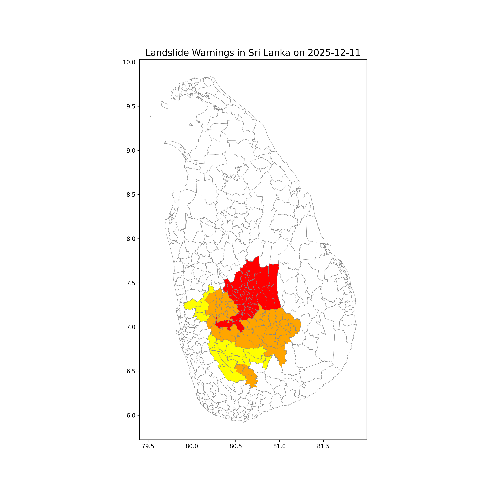

# 🇱🇰 Sri Lanka: Landslide Warnings

From the [Disaster Management Centre](https://www.dmc.gov.lk/index.php?option=com_dmcreports&view=reports&Itemid=276&report_type_id=5&lang=en).

## Landslide Warning Map

## Latest Warnings (2025-12-12)

### 🟡 Level 1 - "watch"

#### `LK-12` Gampaha

- `LK-1209` Divulapitiya
- `LK-1212` Mirigama
- `LK-1227` Attanagalla

#### `LK-92` Kegalle

- `LK-9221` Ruwanwella
- `LK-9230` Dehiowita
- `LK-9233` Deraniyagala

#### `LK-91` Ratnapura

- `LK-9103` Eheliyagoda
- `LK-9106` Kuruvita
- `LK-9109` Kiriella
- `LK-9112` Ratnapura
- `LK-9115` Imbulpe
- `LK-9118` Balangoda
- `LK-9119` Kalthota
- `LK-9121` Opanayake
- `LK-9124` Pelmadulla
- `LK-9127` Elapatha
- `LK-9130` Ayagama
- `LK-9133` Kalawana
- `LK-9136` Nivithigala

### 🟠 Level 2 - "alert"

#### `LK-81` Badulla

- `LK-8109` Meegahakiula
- `LK-8112` Kandeketiya
- `LK-8115` Soranathota
- `LK-8118` Passara
- `LK-8119` Lunugala
- `LK-8121` Badulla
- `LK-8124` Hali-Ela
- `LK-8127` Uvaparanagama
- `LK-8130` Welimada
- `LK-8133` Bandarawela
- `LK-8136` Ella
- `LK-8139` Haputale
- `LK-8142` Haldummulla

#### `LK-21` Kandy

- `LK-2103` Tumpane
- `LK-2106` Poojapitiya
- `LK-2109` Akurana
- `LK-2127` Kundasale
- `LK-2130` Gangawata Korale
- `LK-2133` Harispattuwa
- `LK-2134` Hatharaliyadda
- `LK-2136` Yatinuwara
- `LK-2139` Udunuwara
- `LK-2145` Pathahewaheta
- `LK-2157` Pasbagekorale

#### `LK-92` Kegalle

- `LK-9203` Rambukkana
- `LK-9206` Mawanella
- `LK-9209` Aranayake
- `LK-9212` Kegalle
- `LK-9215` Galigamuwa
- `LK-9218` Warakapola
- `LK-9224` Bulathkohipitiya
- `LK-9227` Yatiyantota

#### `LK-61` Kurunegala

- `LK-6157` Mallawapitiya
- `LK-6160` Mawathagama
- `LK-6184` Alawwa
- `LK-6187` Polgahawela

#### `LK-22` Matale

- `LK-2209` Naula
- `LK-2212` Pallepola
- `LK-2215` Yatawatta
- `LK-2218` Matale
- `LK-2221` Ambanganga
- `LK-2224` Laggala
- `LK-2227` Wilgamuwa
- `LK-2230` Rattota
- `LK-2233` Ukuwela

#### `LK-23` Nuwara Eliya

- `LK-2303` Kothmale East
- `LK-2304` Kothmale West
- `LK-2306` Hanguranketa
- `LK-2307` Mathurata
- `LK-2309` Walapane
- `LK-2310` Nildandahinna
- `LK-2312` Nuwara Eliya
- `LK-2313` Thalawakele
- `LK-2315` Ambagamuwa Korale
- `LK-2316` Norwood

#### `LK-91` Ratnapura

- `LK-9139` Kahawattha
- `LK-9142` Godakawela
- `LK-9151` Kolonna

### 🛑 Level 3 - "evacuate"

#### `LK-21` Kandy

- `LK-2112` Pathadumbara
- `LK-2115` Panvila
- `LK-2118` Ududumbara
- `LK-2121` Minipe
- `LK-2124` Medadumbara
- `LK-2142` Doluwa
- `LK-2148` Deltota
- `LK-2151` Udapalatha
- `LK-2154` Ganga Ihala Korale

#### `LK-61` Kurunegala

- `LK-6163` Rideegama
