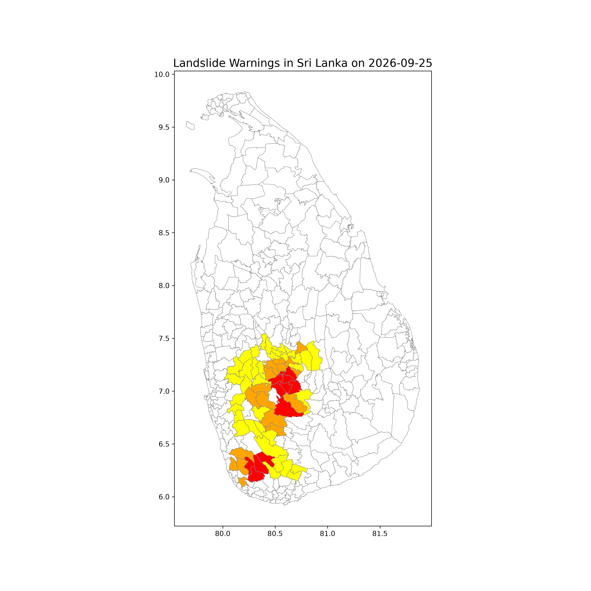

# 🇱🇰 Sri Lanka: Landslide Warnings

From the [Disaster Management Centre](https://www.dmc.gov.lk/index.php?option=com_dmcreports&view=reports&Itemid=276&report_type_id=5&lang=en).

## Landslide Warning Map

## Latest Warnings (2026-02-23)

### 🟡 Level 1 - "watch"

#### `LK-81` Badulla

- `LK-8109` Meegahakiula
- `LK-8112` Kandeketiya
- `LK-8118` Passara
- `LK-8133` Bandarawela
- `LK-8139` Haputale

#### `LK-33` Hambantota

- `LK-3325` Walasmulla

#### `LK-21` Kandy

- `LK-2139` Udunuwara
- `LK-2145` Pathahewaheta
- `LK-2151` Udapalatha
- `LK-2157` Pasbagekorale

#### `LK-92` Kegalle

- `LK-9224` Bulathkohipitiya
- `LK-9233` Deraniyagala

#### `LK-61` Kurunegala

- `LK-6157` Mallawapitiya
- `LK-6163` Rideegama

#### `LK-82` Monaragala

- `LK-8221` Wellawaya

#### `LK-23` Nuwara Eliya

- `LK-2303` Kothmale East
- `LK-2304` Kothmale West
- `LK-2306` Hanguranketa
- `LK-2307` Mathurata

#### `LK-91` Ratnapura

- `LK-9103` Eheliyagoda
- `LK-9106` Kuruvita
- `LK-9136` Nivithigala
- `LK-9151` Kolonna

### 🟠 Level 2 - "alert"

#### `LK-81` Badulla

- `LK-8142` Haldummulla

#### `LK-31` Galle

- `LK-3115` Niyagama

#### `LK-21` Kandy

- `LK-2112` Pathadumbara
- `LK-2118` Ududumbara
- `LK-2124` Medadumbara
- `LK-2136` Yatinuwara
- `LK-2142` Doluwa
- `LK-2154` Ganga Ihala Korale

#### `LK-92` Kegalle

- `LK-9206` Mawanella
- `LK-9209` Aranayake
- `LK-9212` Kegalle
- `LK-9227` Yatiyantota
- `LK-9230` Dehiowita

#### `LK-22` Matale

- `LK-2221` Ambanganga
- `LK-2224` Laggala
- `LK-2227` Wilgamuwa
- `LK-2230` Rattota
- `LK-2233` Ukuwela

#### `LK-82` Monaragala

- `LK-8218` Badalkumbura

#### `LK-23` Nuwara Eliya

- `LK-2309` Walapane
- `LK-2310` Nildandahinna

#### `LK-91` Ratnapura

- `LK-9109` Kiriella
- `LK-9112` Ratnapura
- `LK-9130` Ayagama
- `LK-9133` Kalawana

### 🛑 Level 3 - "evacuate"
