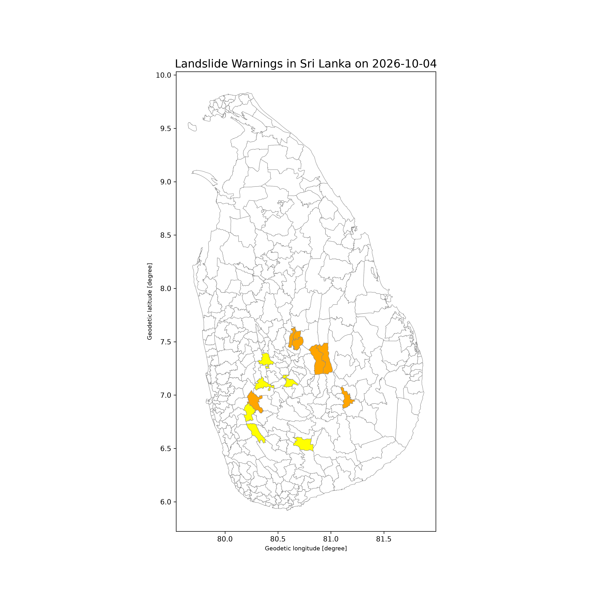

# 🇱🇰 Sri Lanka: Landslide Warnings

From the [Disaster Management Centre](https://www.dmc.gov.lk/index.php?option=com_dmcreports&view=reports&Itemid=276&report_type_id=5&lang=en).

## Landslide Warning Map

## Latest Warnings (2026-10-08)

### 🟡 Level 1 - "watch"

#### `LK-13` Kalutara

- `LK-1339` Walallawita

#### `LK-21` Kandy

- `LK-2134` Hatharaliyadda
- `LK-2136` Yatinuwara

#### `LK-92` Kegalle

- `LK-9203` Rambukkana
- `LK-9209` Aranayake
- `LK-9212` Kegalle
- `LK-9227` Yatiyantota
- `LK-9230` Dehiowita

#### `LK-61` Kurunegala

- `LK-6184` Alawwa

#### `LK-91` Ratnapura

- `LK-9103` Eheliyagoda
- `LK-9106` Kuruvita
- `LK-9112` Ratnapura
- `LK-9130` Ayagama
- `LK-9133` Kalawana
- `LK-9145` Weligepola

### 🟠 Level 2 - "alert"

#### `LK-92` Kegalle

- `LK-9206` Mawanella
- `LK-9221` Ruwanwella
- `LK-9224` Bulathkohipitiya

### 🛑 Level 3 - "evacuate"
